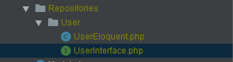
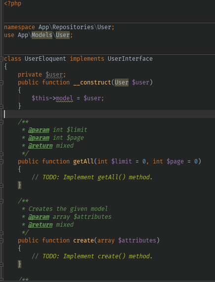
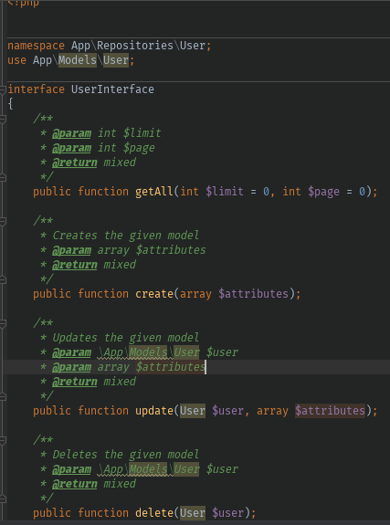
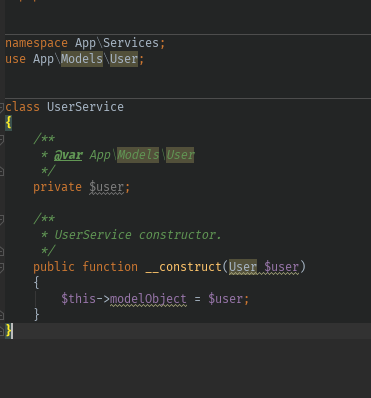

<h1>
Laravel Design patterns
</h1>

<p align="center">
  <a href="https://travis-ci.org/laravel-zero/framework"></img></a>
  <a href="https://scrutinizer-ci.com/g/laravel-zero/framework"></img></a>
  <a href="https://packagist.org/packages/laravel-zero/framework"></a>
  <a href="https://packagist.org/packages/laravel-zero/framework"></a>
  <a href="https://packagist.org/packages/laravel-zero/framework"></a>
</p>

<h4> <center>This is a <bold>community project</bold> and not an official Laravel one </center></h4>

Laravel Design Patterns was created by, and is maintained by [Innocent Mazando](https://github.com/innoflash), and is console application running on composer used to create Laravel Repository and Service pattern. 
## Installation

Install via composer.

Note: For windows user, first run `composer global update`

```bash
composer global require innoflash/laravel-design-patterns
```
### Create a repository
```sh
ldp pattern:repository {model_name}
```
The ```model_name``` is the model you wanna create a repository for
eg
```dotenv
ldp pattern:repository Models/User
``` 
links a the ```App\Models\User```
And likewise 
```
ldp pattern:repository User
```
links ```App\User```
Command creates the repo folder under Repositories in the model name folder



This creates an ModelEloquent file that you are gonna have to override when you are passing your app login



Also it creates an interface that`s used in the Eloquent file. You can add or remove more abstract methods to this to further customize your repo




### Create a service
```dotenv
ldp pattern:service {model_name}
```
The ```model_name``` is the model you wanna create a repository for
eg
```dotenv
ldp pattern:service Models/User
```
links a the ```App\Models\User```
And likewise 
```
ldp pattern:service User
```
links ```App\User```
Command creates the service file Services with your model name concatenated with "Service"


This is how the service class created looks like


